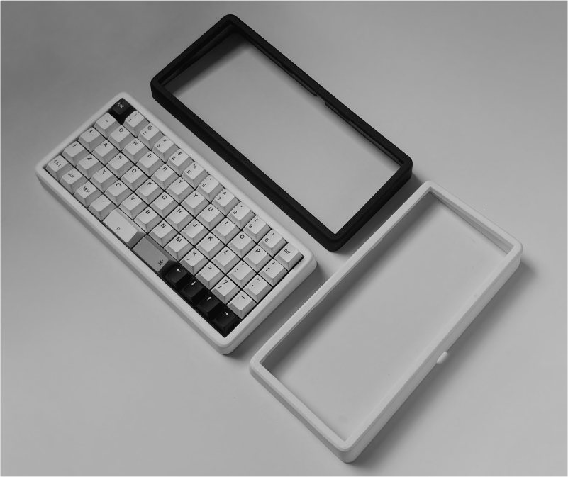
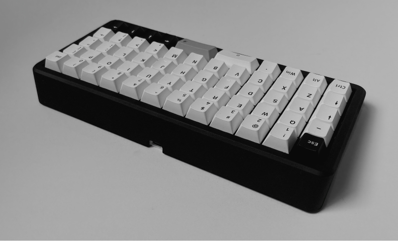
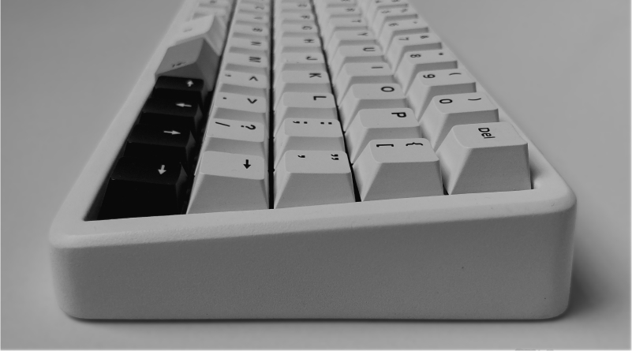

# Form Zero
> Gasket mounted ortholinear keyboard

## Introduction
This project aims to provide an ergonomic keyboard that looks nice while also including the neat features that you'd find in custom mechanical keyboards:

- Gasket-mounted.
- Hotswap PCB.
- Clean and minimal design.

It's also designed to be put together by hobbyists, so all the parts can be easily sourced and only basic soldering skills are required.

## Build guide
See [build](/build)

## Thanks
[JLCPCB](https://jlcpcb.com/) for providing the keyboard plate, 3D printed case, and PCBs for this project. If you're looking to build your own board, I highly recommend their services.